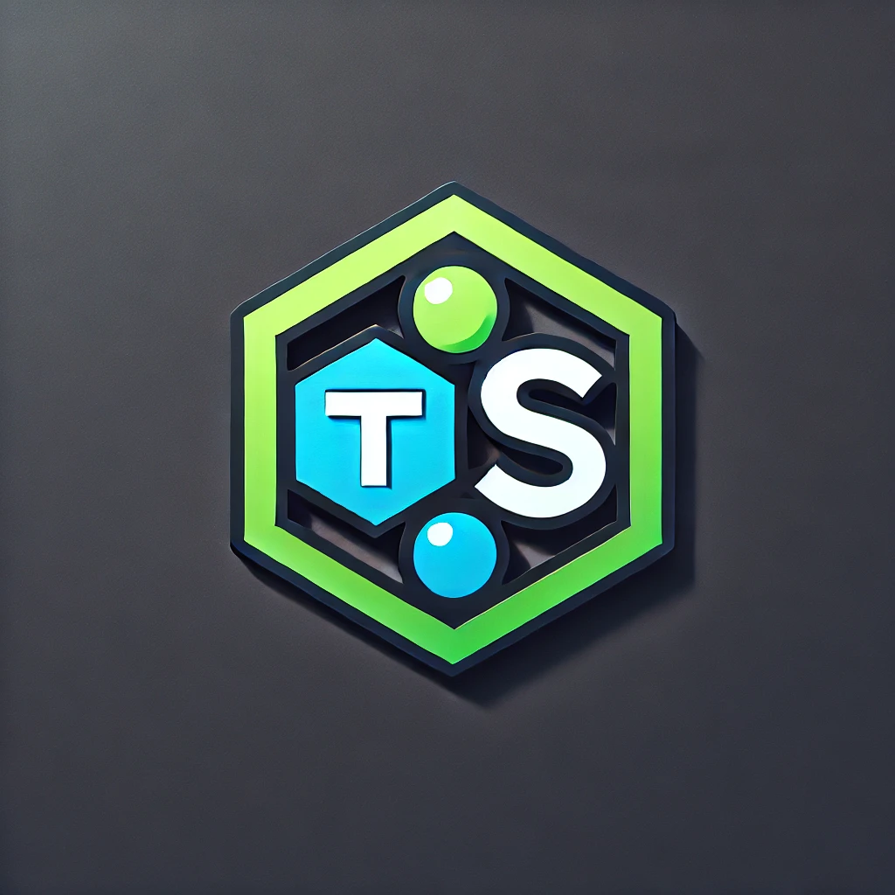

<p align="center">
  
  <h1 align="center">✨ TypeScript Express Backend ✨</h1>
  <p align="center">
    <br/>
    This boilerplate contains a robust and scalable backend application built with Node.js and TypeScript. The application leverages modern technologies and architectures to provide both RESTful and GraphQL APIs, ensuring flexibility and efficiency. It integrates MongoDB for data storage, Redis and Bull for job queues,in future laying the foundation for a microservices architecture.
  </p>
</p>
<br/>

## Features

- **RESTful APIs** built with TSOA for seamless integration and documentation.
- **GraphQL Server** powered by TypeGraphQL, enabling flexible and efficient data queries.
- **Type-Safe Database Operations** using MongoDB with Mongoose and Typegoose.
- **Job Queues** managed by Bull and Redis, ensuring efficient background processing.
- **Bull-Board UI** for monitoring and managing job queues.

## Technologies Used

### TSOA for REST APIs

[TSOA](https://tsoa-community.github.io/docs/getting-started.html) is a framework for building RESTful APIs with TypeScript. It allows you to define your API routes and models using TypeScript decorators, ensuring type safety and automatic Swagger documentation generation.

### TypeGraphQL for GraphQL Server

[TypeGraphQL](https://typegraphql.com/) is a modern framework for building GraphQL APIs with TypeScript. It simplifies the creation of GraphQL schemas by using TypeScript classes and decorators, enabling a more intuitive and type-safe development experience.

### MongoDB with Mongoose and Typegoose

MongoDB is a NoSQL database that offers flexibility and scalability for storing application data. [Mongoose](https://mongoosejs.com/) is an ODM (Object Data Modeling) library for MongoDB and Node.js, providing a straightforward schema-based solution to model your application data. [Typegoose](https://typegoose.github.io/typegoose/docs/guides/quick-start) builds on Mongoose by integrating TypeScript classes, offering type-safe schemas and models.

### Bull with Redis for Queues

[Bull](https://github.com/OptimalBits/bull) is a Node.js library for creating robust job queues backed by Redis. It allows you to handle background processing efficiently, ensuring tasks are processed reliably and timely.

### Bull-Board UI

[Bull-Board](https://github.com/vcapretz/bull-board) is a web interface for managing Bull queues. It provides real-time monitoring of job statuses, allowing you to inspect, retry, and manage jobs effortlessly.

## Getting Started

Follow these instructions to set up and run the project on your local machine.

### Prerequisites

Ensure you have the following installed:

- [Docker](https://www.docker.com/get-started)
- [Docker Compose](https://docs.docker.com/compose/install/)
- [Nodejs](https://nodejs.org/en)

## Installation

### 1. Clone the repository

```bash
git clone https://github.com/yourusername/your-repo-name.git
cd your-repo-name
```

### 2. Set up the environment variables

Create a .env file in the root directory (if not already present) and configure the following variables based on your requirements. The project comes with a sample \`.env\` file.

```bash
PORT=5000
GRAPHQL_PORT=4000
NODE_ENV=development

# MongoDB
MONGODB_URL=mongodb+srv://<username>:<password>@cluster0.mongodb.net/<database>

# JWT Settings
JWT_SECRET=your-secret-key
JWT_EMAIL_SECRET=your-email-secret-key
JWT_ACCESS_EXPIRATION_MINUTES=2880
JWT_REFRESH_EXPIRATION_DAYS=90
JWT_VERIFY_EMAIL_EXPIRATION_MINUTES=10

# RabbitMQ
RMQ_USER=guest
RMQ_PASSWORD=guest
RMQ_HOST=localhost
RMQ_PORT=5672

# Redis
REDIS_HOST=localhost
REDIS_PORT=6379
```

### 3. Build and run the application using Docker

To start the application and its services (MongoDB, Redis, and RabbitMQ) in Docker containers, run:

```bash
docker-compose up --build
```

This will:

- Build the Docker images for your services.
- Start the `app`, `mongodb`, `redis`, and `rabbitmq` containers.
- Expose ports as defined in the \`docker-compose.yml\` file.

### 4. Verify the services

Once the containers are up and running, you can verify the following services:

- Express app: `http://localhost:5000`
- GraphQL API (if applicable): `http://localhost:4000`
- RabbitMQ Management UI: `http://localhost:15672` (Default credentials: guest/guest)

### 5. Running in detached mode

To run the containers in the background (detached mode), use:

```bash
docker-compose up --build -d
```

### 6. Stop the services

To stop all running containers:

```bash
docker-compose down
```

This will stop and remove all containers, networks, and volumes created by \`docker-compose up\`.

## Health Check

RabbitMQ has a health check in place. If RabbitMQ fails to start or becomes unhealthy, Docker will automatically restart the container.

## Troubleshooting

- Make sure that Docker is running on your machine.
- Check if the ports you are trying to bind (5000, 4000, 5672, 15672, etc.) are available and not being used by other services.
- Review logs with:

```bash
docker-compose logs
```
    
## Contributions
You're invited to contribute to this project! Feel free to submit issues or pull requests—let's collaborate and create something extraordinary together!

## License
This project is licensed under the MIT License - see the LICENSE file for details.


   
